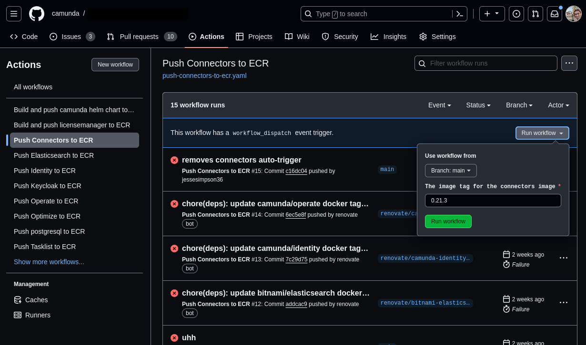

# AWS Marketplace Dockerfiles

## Overview

This repo exists to hold CI for mirroring the docker images from a combination of registry.camunda.cloud and docker.io onto the repositories hosted in AWS. When we created this repo, we intended for there to be updates to the dockerfiles necessary for releasing on the AWS Marketplace. One such example would be that images are required to run as non-root directly in the image. However, we managed to complete those requirements directly in the upstream images.

The intended folder structure was to have a folder per application component, with a Dockerfile that uses an upstream image and makes any necessary modifications. Aside from that, the usual .github folder for CI.

There were a few unintended uses for this repository as I learned more about the AWS Marketplace. Those uses are:

* licensemanager - holds scripts / manifests related to the AWS License Manager.
* firstuser-password.yaml - This manifest will create a first user and assign a random password. This is a requirement for being on the AWS Marketplace.

## License Manager

### Overview of the AWS License Manager backend

The AWS License Manager is what determines whether a customer has actually purchased the product or not. AWS has a backend system that installations will register onto. This registration process is called "Checking out a license" in AWS terminology. Once the application is registered with the aws license manager backend, then our application will then report metrics based on the customer's usage.

### Our LicenseManager

The script `checkoutLicense.py` in the licensemanager folder will simply check out a license using the api. This is mostly a copy of AWS's default script they recommend in the AWS Marketplace Sellers Guide.

`requirements.txt` is a standard python file that lists dependencies for the `checkoutLicense.py` program.

`chart_preinstall_hook.yaml` is a helm pre-install hook that will call the `checkoutLicense.py` program. It creates a kubernetes job that will prevent the rest of the helm installation if the customer does not have a valid license. Possible error scenarios are:
- Customer has an expired license.
- Customer has an invalid license.
- Customer has no license.

This chart pre-install hook (`chart_preinstall_hook.yaml`) and the first password configuration (`firstuser-password.yaml`) will get installed as part of the `.github/workflows/aws-marketplace-camunda-helm-chart.yaml` workflow. This workflow will take an existing version of the helm chart, untar it, inject these kubernetes manifests, tar it, and then push it up to the AWS Marketplace registry.

For iteration 1, we did not worry about reporting any metrics to the license manager. Customers will check out a license and AWS will know that the customer does have a license.

## CI Pipelines

Most of the CI Pipelines are semi-automated scripts that will take one version of a dependency (such as camunda/zeebe:8.3.4) and will push it to an AWS Marketplace registry. The only pipeline that has more complex logic is `.github/workflows/aws-marketplace-camunda-helm-chart.yaml`, which pushes a helm chart to the ECR.

What's odd about that is it's a helm chart and not a docker image, but there is an oci way of pushing helm charts to docker image registries.

When I say this is "semi-automated", I mean that each workflow needs to be manually kicked off via filling out a form on the "Run workflow" button. For most of these github actions, the only input you need is the image tag. I have included renovate so that the default image tag should be the latest available.

## Constraints relating to the Marketplace ECR

The AWS Marketplace ECR does not allow update or deletion actions. Suppose zeebe re-releases 8.3.4 and we already mirrored 8.3.4 to the ECR.  There is no way to upload a new version, and even contacting AWS Support to drop this version is not allowed.

Furthermore, the AWS Marketplace ECR is not the same as the AWS ECR. Any integrations like connecting Harbor to AWS ECR may not work for the Marketplace ECR. And furthermore, one cannot look in the AWS Console to view images in the AWS Marketplace ECR.

## Constraints when dealing with forms in AWS Marketplace Management Portal

All of the forms in the AWS Marketplace Management Portal have confusing validation errors that will clear out the form when you try to submit it. My STRONG recommendation is to fill out every form in a text file and copy and paste inputs into the form.

Do not be fooled by the "Copy from previous request" button. This functionality does not work. Use a text file.

