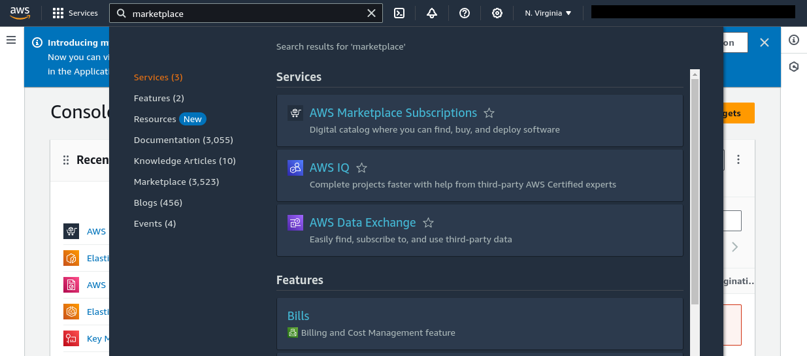
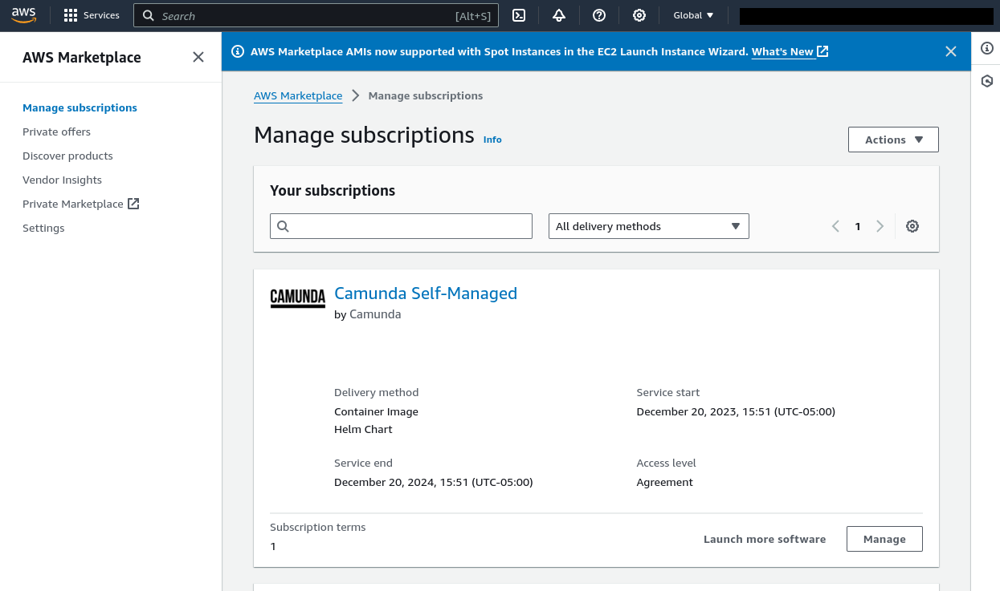
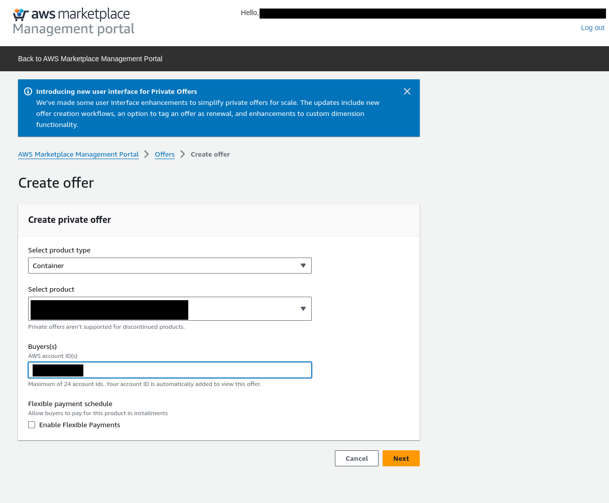
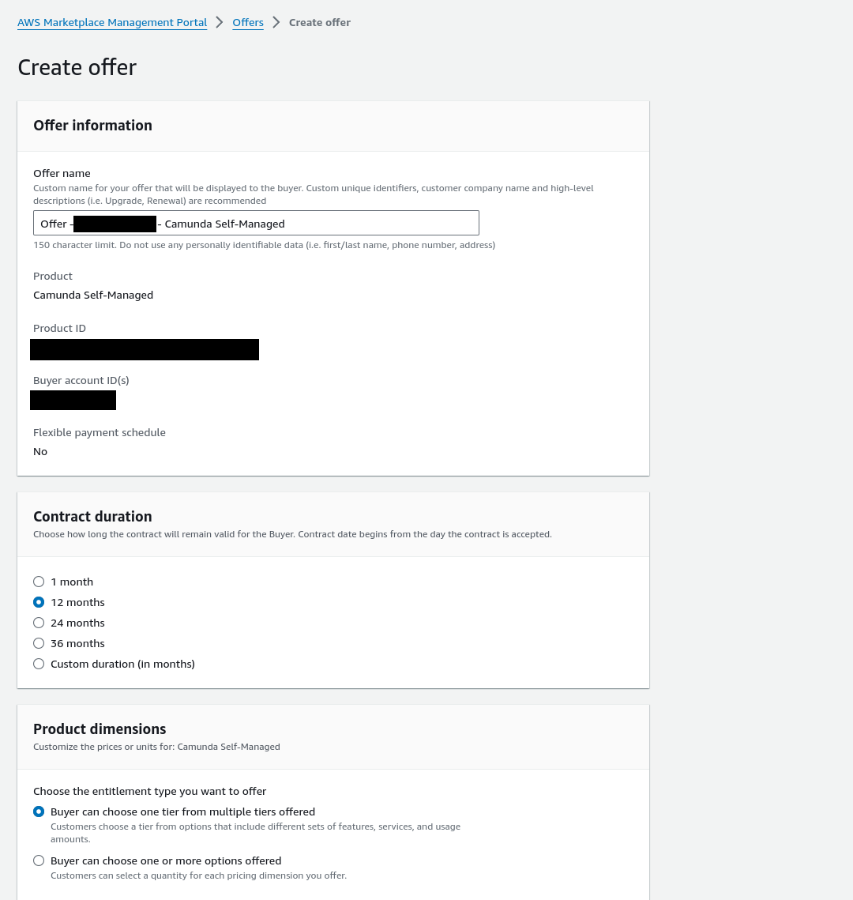
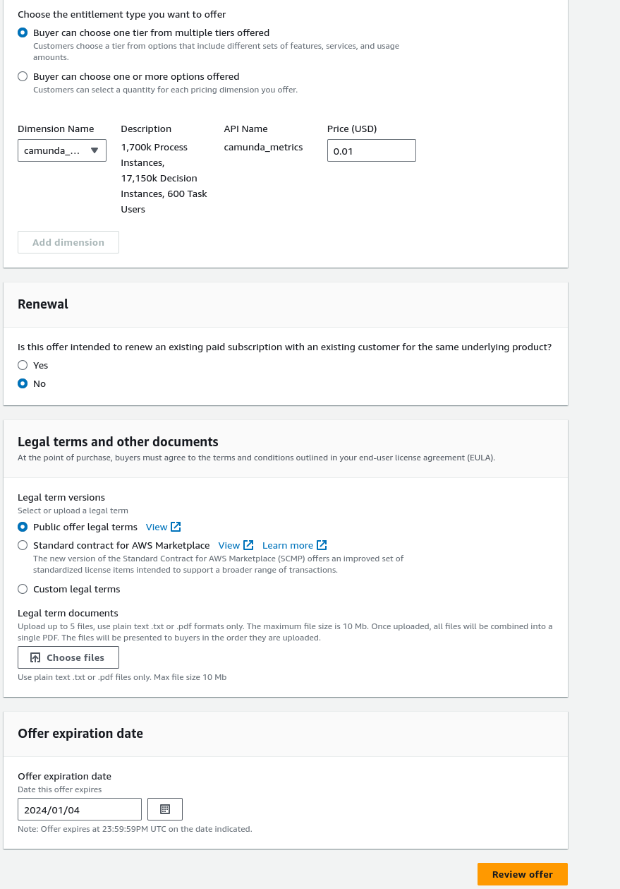

# How to test an AWS Marketplace Installation

Once a request to add a version is submitted through the AWS Marketplace Management Portal, this version is not immediately publicly available. Instead, you can test prior to making this version public. Follow the steps in this guide to do it.

The first step is to get access to an AWS "Subscription". 

## Checking to see if you already have an AWS Subscription
In the AWS Console, search for AWS Marketplace Subscriptions


An active "Camunda Self-Managed" subscription looks like this:


## Option 1: Getting the AWS account permission to access the restricted new version

Navigate to the [AWS Marketplace Management Portal](https://aws.amazon.com/marketplace/management/products/server), and then click "Camunda Self-Managed".

TODO: ... I don't see the option to add an AWS Account anymore.  Perhaps it's only visible when a Version is under "limited" status.  Next release, I will update this.

## Option 2: Creating a Private Offer to lower the price (good for testing a publicly available version)

Navigate to the [AWS Marketplace Management Portal](https://aws.amazon.com/marketplace/management/products/server), and then click "Offers" and then "Private offers" in the toolbar dropdown menu.

Click "Create an offer"

Enter "Container" as the product type
Enter "Camunda Self-Managed" as the product
Enter your AWS account ID

Then select a price of something small like a dollar.





TODO: include steps for accepting the private offer. Unfortunately I do not have permissions yet for this.

## Follow the Install Guide

The documentation can be found on [Camunda Docs - AWS Marketplace Install guide](https://docs.camunda.io/docs/next/self-managed/platform-deployment/helm-kubernetes/guides/aws-marketplace/).


### Common Pitfalls

#### Helm install hangs
When the helm install command hangs, what that means is that the kubernetes job that is making a request to the AWS License Manager is likely failing. If you open up the logs on the license manager pod, you may see something like this:

```
Error could not call LM checkout api **An error occurred (AuthorizationException) when calling the CheckoutLicense operation: User: arn:aws
:sts::ACCOUNTID:assumed-role/eksctl-jessecluster7-nodegroup-ng--NodeInstanceRole-HASH is not authorized to p
erform: license-manager:CheckoutLicense because no identity-based policy allows the license-manager:CheckoutLicense action 
```

#### PVC's fail to create

I don't have an example of the error message, but the symptoms of this type of error include many of the pods being in the Creating status and PVC's failing to bind. If you see errors in the PVC's `kubectl describe`, it'll inform you of the permission that's necessary to add.  I often run into this error when I'm testing using an EKS cluster I've already used before (due to resources being left behind from a previous install).  It could also mean that the storage class addon for SSD's failed to install properly.

This means that the NodeGroup needs the license-manager:CheckoutLicense permission. Contact IT to grant this permission.
